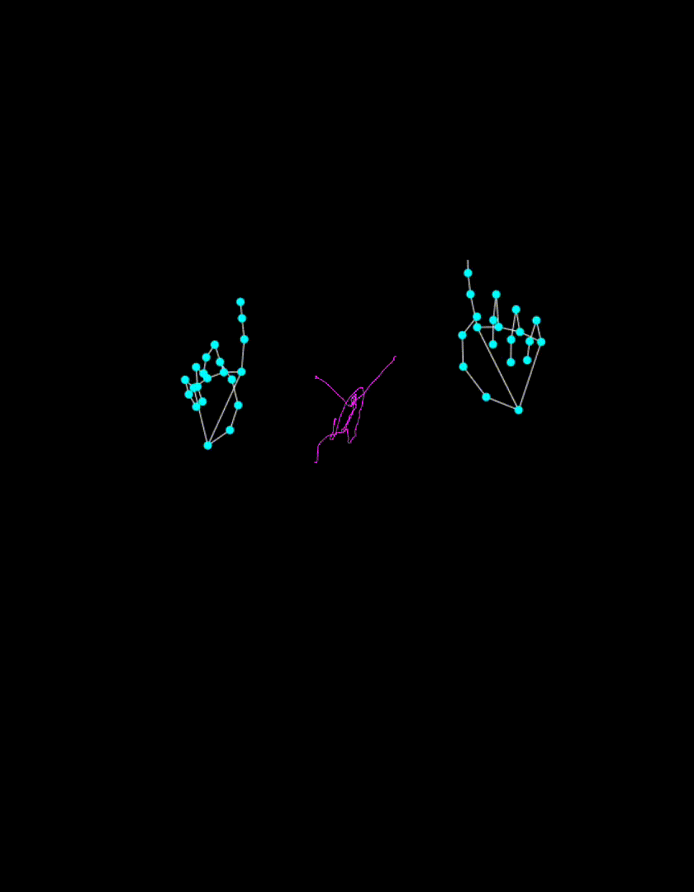

# Hand Landmark Detection App

This is a web application that uses MediaPipe's Hand Landmarker to detect and display hand landmarks in real-time using your webcam.

## Demo



> Replace the above line with your own GIF to showcase the app in action.

## Features

- Real-time hand landmark detection using your webcam
- Modern UI with a centered layout and start button
- Built with Vite, TypeScript, and MediaPipe

## Getting Started

1. **Install dependencies:**
   ```bash
   npm install
   ```
2. **Run the development server:**
   ```bash
   npm run dev
   ```
3. **Open your browser:**
   Visit [http://localhost:5173/](http://localhost:5173/) and click the Start button to begin.

## Project Structure

- `src/` — Main source code
- `public/models/` — MediaPipe model file
- `index.html` — Main HTML file
- `src/style.css` — App styling

## Add Your Demo GIF

- Record a GIF of your app in action (e.g., with [ScreenToGif](https://www.screentogif.com/) or [LICEcap](https://www.cockos.com/licecap/)).
- Save it as `demo.gif` in the project root.
- The GIF will appear in the README above.

## License

This project is for educational/demo purposes. MediaPipe models are subject to their own license.
